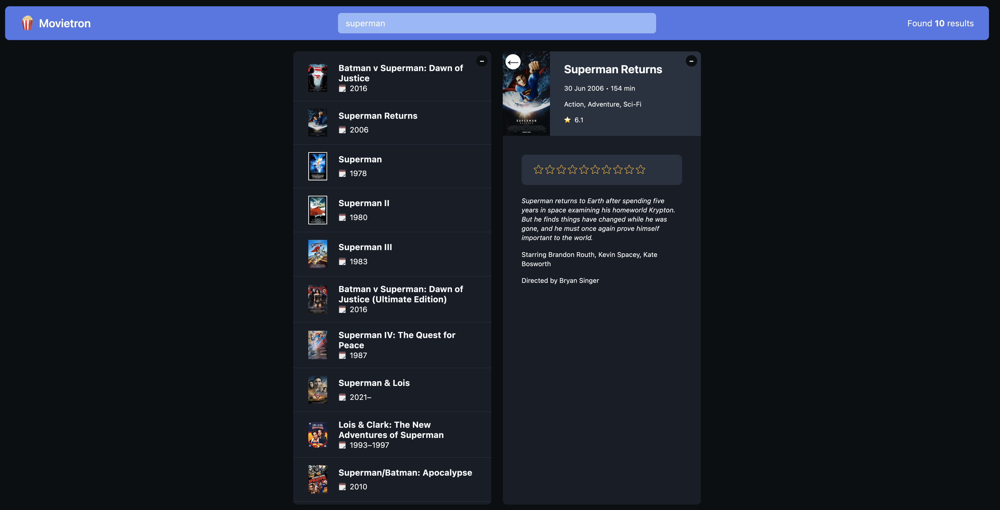

# Movietron - README

Welcome to Movietron, your ultimate movie search application!

## Introduction

Movietron is an innovative web application built with TypeScript and React.js, aimed at helping you discover and explore an extensive collection of movies using the IMDb API. With its sleek design and robust search capabilities, Movietron offers an immersive movie browsing experience.

## Getting Started

To run Movietron locally on your machine, follow these simple steps:

1. Make sure you have Node.js installed on your computer.
2. Download or clone the Movietron repository to your local machine.
3. Open your preferred terminal, navigate to the project folder, and install all the necessary dependencies by running the command `npm install`.
4. Start the development server with the command `npm run dev`.
5. Once the server is up and running, access the application by visiting `http://localhost:5173/` in your web browser.

## Features

- **Movie Search**: Effortlessly search for movies by entering keywords in the search bar and receive real-time results.
- **Movie Details**: Click on a movie from the search results to view comprehensive information, including ratings, release date, and plot summary.
- **Custom Components**: Movietron is built using custom React components to provide a seamless and responsive user experience.

## Embracing Modern Technologies

Movietron makes use of the following cutting-edge technologies:

- **TypeScript**: A superset of JavaScript that enhances code quality and maintainability.
- **React.js**: A leading JavaScript library for building powerful and dynamic user interfaces.
- **IMDb API**: We harness the IMDb API to fetch movie data and present it in an engaging and user-friendly manner.
